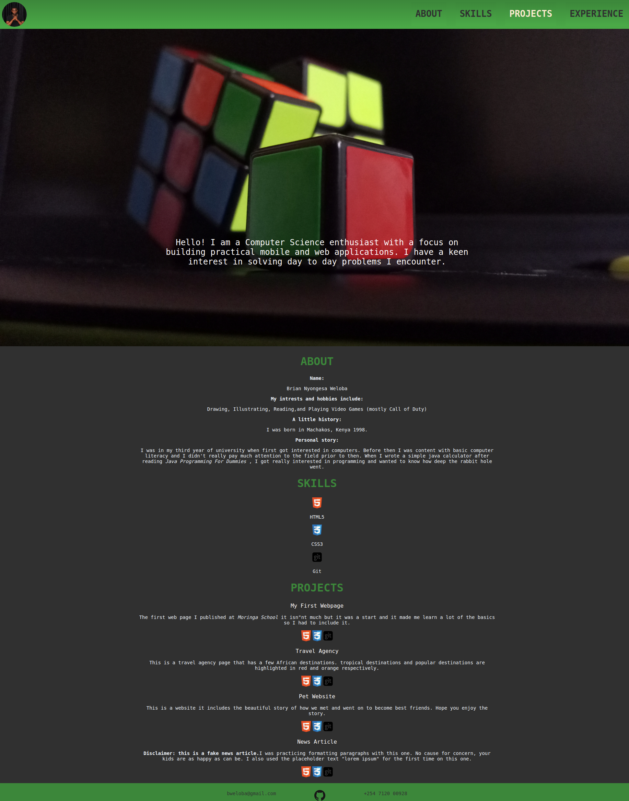

# Portfolio Landing Page

## **Author**: Brian Weloba

## Description

I am a budding devoloper currently enrolled at [Moringa School](https://moringaschool.com/) on the *Software Development Prep* course. Throughout my learning expeirnce I will add more information and projects to my portfolio.
 Feel free to pop in and check out my Portfolio at any time.

 This site was built using [GitHub Pages](htps://pages.github.com/).
 
 The mobile page was built using [Netlify](https://app.netlify.com/). Visit the [mobile branch](https://github.com/Brian-Weloba/Portfolio-landing-page/tree/mobile) to view the code.
 
## Page Preview

## Setup

 1. Clone this repository.
 2. Open the project directory.
 3. Run index.html on your browser.

- Alternatively, view on [GitHub Pages](https://brian-weloba.github.io/Portfolio-landing-page/) on browser.
- Or, view the [mobile viesion](https://brian-weloba-portfolio-mobile.netlify.app/) for mobile.

## Technologies Used

- HTML
- CSS
- Git

## Legal

 Copyright &copy; 2020 Brian N Weloba
